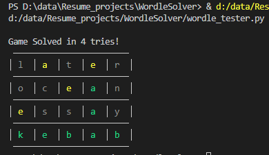
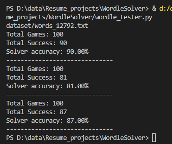
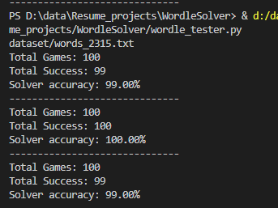

# WordleSolver

## Description : 
- A python project to automatically create and solve Wordle games.
- Uses a fixed list of words to create and guess wordles.
  - words_2315.txt : 2315 Words
  - words_12792.txt : 12792 Words
- Includes the ability to auto play one game as well as test 100s of wordle games. 


## Results :
 #### **1. For A Single Game**:
- 

#### **2. Testing Accuracy with 100s of Games**

- Accuracy values based on the random list of words selected for the Game
- Accuracy also depend on which word list is being used 

Here are a few examples of Tests :

1. Larger list of **12792** words has mostly less than 90% accuracy
- 

2. Smaller list of **2315** words
- 

# To Run the project 

```
python -m venv .venv                #virtual env
pip install -r requirements.txt
python wordle_tester.py

```
#
## Project Structure :
```
wordle_game.py

    Class: WordleGame
        Methods:
            __init__(self, word_list)
            guess_word(self, guess)
            is_solved(self, feedback)
            game_over(self)
            print_wordle(self)
```
```
wordle_solver.py

    Class: WordleSolver
        Methods:
            __init__(self, word_list)
            get_best_guess(self)
            update_possible_words(self, guess, feedback)
            print_wordle(self, guess_feedback_list)
```
```
wordle_tester.py

    Functions: 
        test_solver(num_games, word_list_file)

```
```
wordle_utils.py

    Functions:
        load_words(word_list_file)
        calculate_letter_frequencies(word_list)
```
